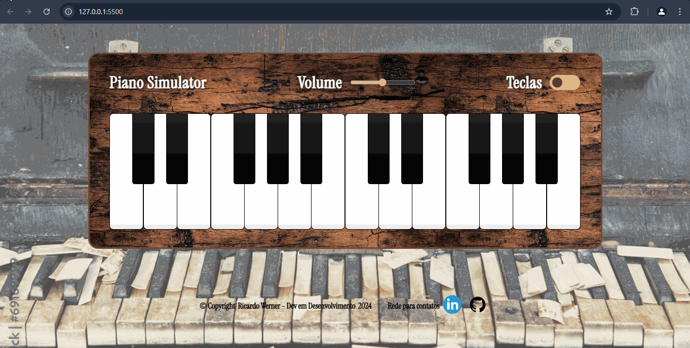
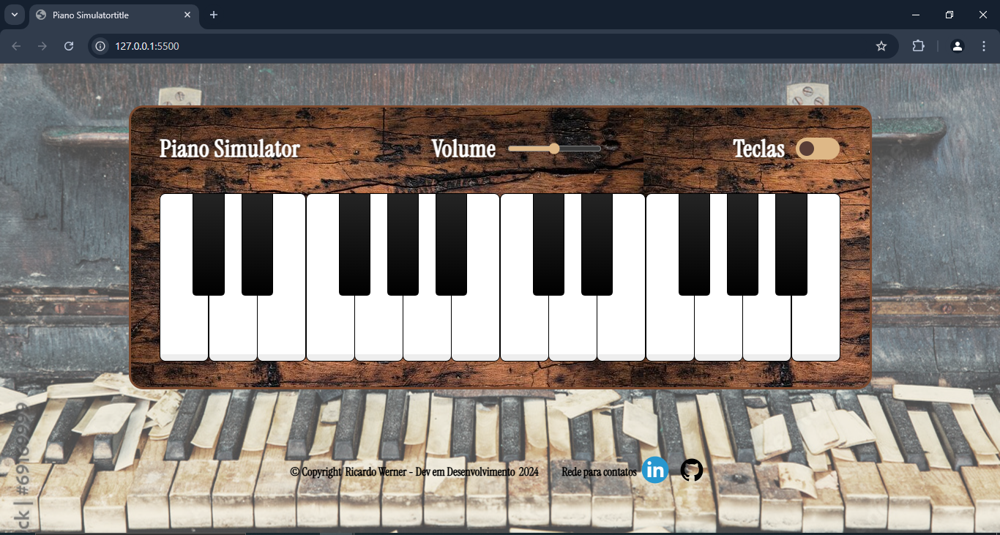
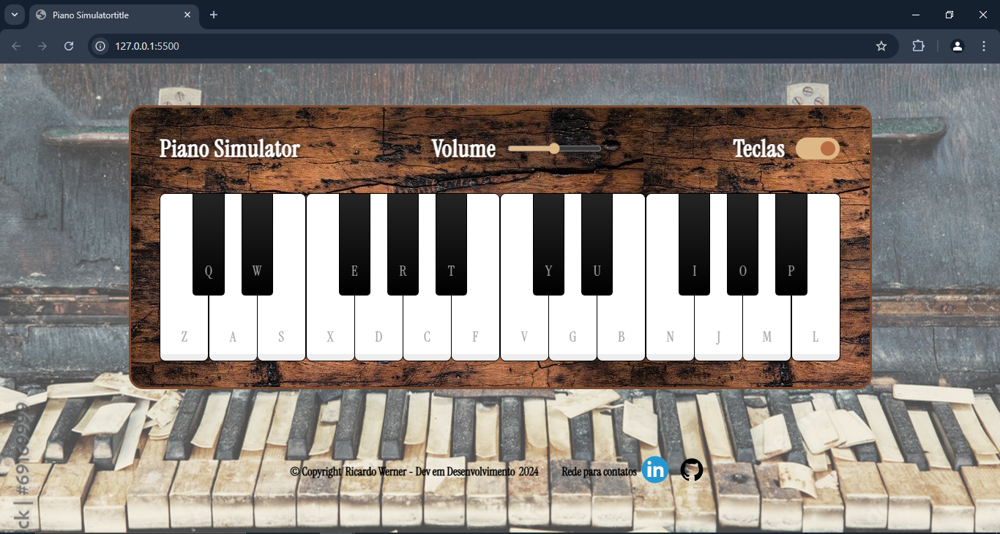
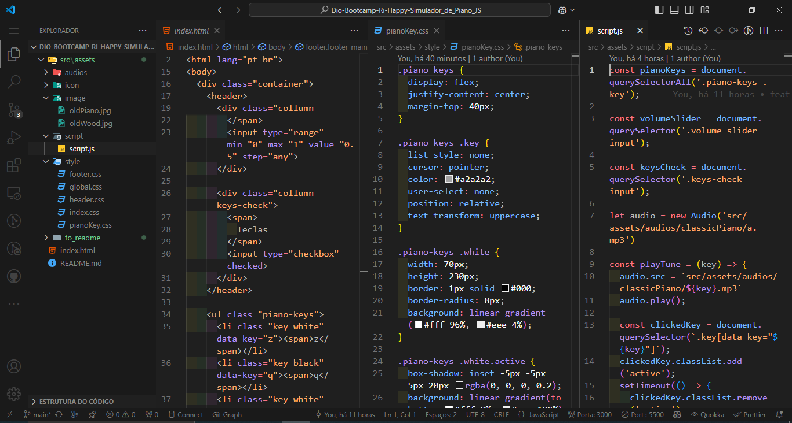
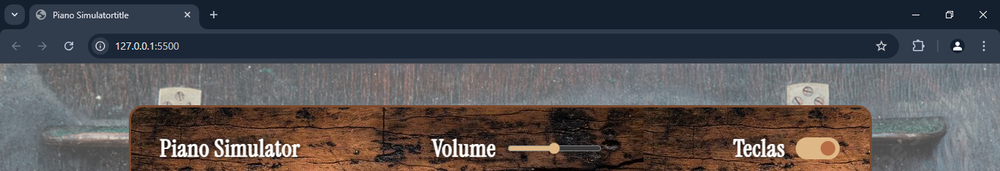

# Desenvolvimento da Página do Paino Virtual

Desafio prático do Bootcamp da Ri Happy, Front-end do Zero, para desenvolver uma página que simula um paino com novas aplicações do Javascript.

## Página estática de Simulador de Piano em JS

### 📜 Sobre o Projeto

Mergulhe na magia do som com o Simulador de Piano Virtual! 🎹✨ 
Inspirado na proposta do instrutor da Dio, Rodrigo Aguiar, este simulador de piano une um design clássico com um toque vintage e funcionalidade prática. Com uma interface interativa, teclas adaptadas ao teclado ABNT e sons realistas, este simulador é pura diversão. Descubra a versatilidade do Javascript e a harmonia entre tecnologia e música! 🎶

### 🔗 Links Úteis

- 

- 

### ✅ Status do Projeto

**Concluído**

### 🎥 Deploy

- https://ricardo-werner.github.io/Dio-Bootcamp-Ri-Happy-Simulador_de_Piano_JS/

#### Gif da Página

  

#### Tela Inicial do Simulador de Piano

  

### Tela Inicial do Simulador de Piano com checked (mostrando as letras das teclas)

  

#### Tela do código

  

### 🧩 Desafio

Ter uma experiência musical, juntando a tecnoligia e um dos instrumentos mais clássicos, o piano. 🎹 
Com foco na experiência do usuário e interatividade, o Simulador de Piano Virtual traz a complexidade de alinhar design clássico com funcionalidade moderna. Cada tecla, som e detalhe visual tenta buscar um equilíbrio entre inovação e tradição. Você está pronto para encarar esse desafio e explorar novos acordes 🎶✨, aplicando a interatividade do usuário com o que foi aprendido na utilização e manipulação do javascript?

### 📝 Requisitos da Aplicação

| Item  | Descrição                                                                       |
|-------|---------------------------------------------------------------------------------|
|  1    | A página deve ser desenvolvida em HTML, CSS e Javascript                        |
|  2    | Modelagem do layout, formatos, tipografias, cores e organização livre.          |
|  2.1  | Opcional: Modelagem de modo livre.                                              |

### 🚀 Plano do Projeto

No desenvolvimento desta página, foram aplicados os seguintes conceitos:

| Item  | Descrição                                   |
|-------|---------------------------------------------|
|  1    | HTML                                        |
|  2    | CSS                                         |
|  3    | Javascript                                  |

### 🛠 Tecnologias Utilizadas

- **Visual Studio Code**
- **HTML**
- **CSS**
- **Javascript**
- **Documentação**
- **ChatGpt**

### 💡 Reflexões

Desenvolver este projeto foi mais um passo no meu desenvolvimento no aprendizado do Javascript, onde juntei a música (que é uma linguagem universal) com o uso da tecnologia. Com o Simulador de Piano Virtual, observei sobre como a tecnologia pode aproximar pessoas da arte, despertando a criatividade e o aprendizado. Cada tecla pressionada lembram que inovação e o clássico podem e devem caminhar juntas.
Foi possível explorar os conceitos do prettier no HTM, a organização do CSS, a manipulação do DOM pelo Javascript e sobre a importância de uma estruturação inteligente para facilitar a manutenção futura das aplicações.

### 📦 Como Executar o Projeto

1. Clone o repositório:
   
  git clone https://github.com/ricardo-werner/Dio-Bootcamp-Ri-Happy-Simulador_de_Piano_JS.git

3. Abra o projeto no Visual Studio Code e ative o Go Live:
    
   

     
   

   

     
   

4. Visualize o resultado na página web:

   

     
   

### 🙋‍♂️ Autor
Ricardo Werner 
Dev em Desenvolvimento
